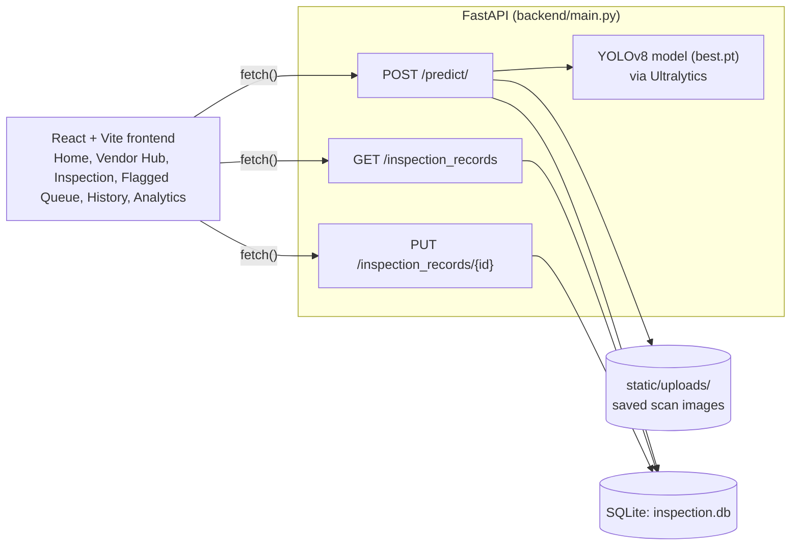
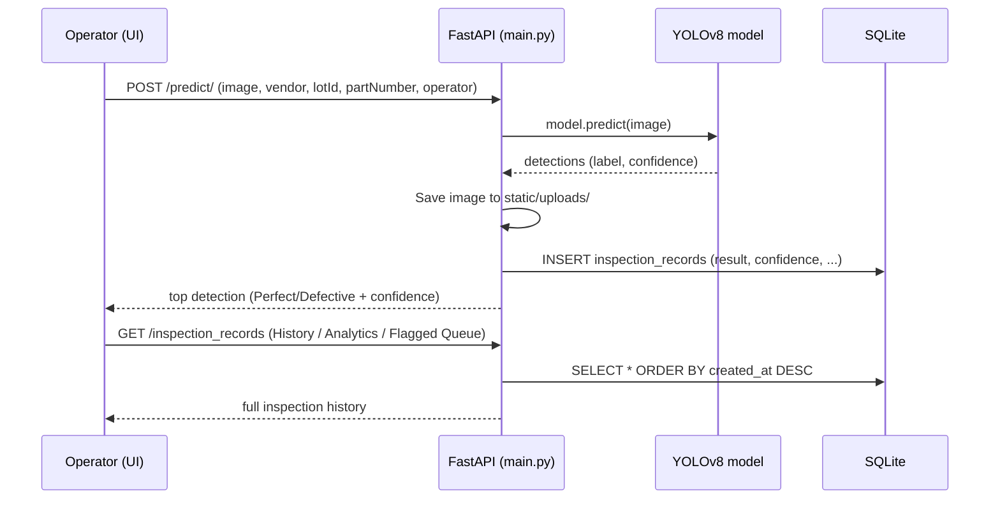

# IC Scanner (MarkScan AI)

A computer vision system that inspects Integrated Circuit (IC) surface markings with a YOLOv8 model and flags counterfeit or defective parts.


## Table of Contents

- [Overview](#overview)
- [Problem Statement](#problem-statement)
- [Solution](#solution)
- [Features](#features)
- [Architecture](#architecture)
- [Tech Stack](#tech-stack)
- [Project Structure](#project-structure)
- [System Workflow](#system-workflow)
- [Installation](#installation)
- [Running Locally](#running-locally)
- [API Documentation](#api-documentation)
- [Author](#author)

## Overview

IC Scanner (branded in the app as MarkScan AI) uploads a photo of an integrated circuit, runs it through a custom-trained YOLOv8 model, and classifies it as "Perfect" or "Defective" with a confidence score. Every inspection is logged locally so results can be reviewed, overridden, and analyzed later. Built for an internal hackathon at GLS University.

## Problem Statement

Counterfeit and defective ICs are a real supply-chain risk on manufacturing lines: mismarked or substandard chips can pass a manual visual check and end up in finished products. Manual inspection doesn't scale to high-volume lots and produces no searchable audit trail.

## Solution

A FastAPI backend loads a YOLOv8 model once at startup. Each uploaded image is run through the model, saved to local disk, and logged to a SQLite database along with vendor, lot, and part metadata. The React frontend gives an operator a home screen, a vendor/lot intake flow, an inspection screen for running scans, a flagged queue for reviewing failures, a history log, and an analytics view, all reading from the same local API.

## Features

| Area | Capability |
|---|---|
| Manual Inspection | Upload a single IC image and get a Perfect/Defective classification with a confidence score |
| Vendor & Lot Intake | Record vendor, lot ID, part number, and operator before scanning |
| Inspection History | Every scan is persisted with its image, result, and confidence |
| Flagged Queue | Failed inspections surface separately so an operator can approve (override to pass) or dismiss them |
| Override Audit | Overriding a flagged result updates the stored record via the API rather than just hiding it in the UI |
| Analytics | Dashboard view over the full inspection history (pass/fail counts, trends) |
| Local-First Storage | Images and records are stored on local disk/SQLite; no cloud dependency in the active code path |

## Architecture



`database/schema.sql` defines an equivalent Postgres table for a Supabase-backed deployment, and the frontend includes a Supabase client (`ui/src/lib/supabaseClient.ts`), but neither is wired into the app's current data flow: the UI talks directly to the local FastAPI backend.

## Tech Stack

| Layer | Technology |
|---|---|
| Backend framework | FastAPI, Uvicorn |
| Computer vision | Ultralytics YOLOv8, OpenCV (`opencv-python-headless`), PyTorch/torchvision (CPU) |
| Database | SQLite (local), with a Postgres/Supabase schema available as an alternative |
| Frontend | React 18, TypeScript, Vite |
| UI components | shadcn/ui (Radix primitives), Tailwind CSS, Lucide icons |
| Data/forms | TanStack Query, React Hook Form, Zod |

## Project Structure

```
IC-SCANNER/
├── backend/
│   ├── main.py               # FastAPI app: predict, inspection_records endpoints
│   ├── best.pt                # Trained YOLOv8 model weights
│   ├── inspection.db          # Local SQLite database
│   ├── static/uploads/        # Saved scan images
│   └── requirements.txt
├── ui/
│   ├── src/
│   │   ├── pages/Index.tsx    # Top-level screen state & navigation
│   │   ├── components/inspection/
│   │   │   ├── HomePage.tsx
│   │   │   ├── VendorHub.tsx
│   │   │   ├── NewLotForm.tsx
│   │   │   ├── InspectionDashboard.tsx
│   │   │   ├── FlaggedQueue.tsx
│   │   │   ├── HistoryLog.tsx
│   │   │   └── Analytics.tsx
│   │   ├── components/ui/     # shadcn/ui component library
│   │   └── lib/supabaseClient.ts  # Present but not currently used by the app
│   └── package.json
├── database/
│   └── schema.sql             # Postgres/Supabase reference schema (alternative to SQLite)
├── start_backend.sh           # Creates venv, installs deps, runs uvicorn
├── start_frontend.sh          # npm install + vite dev server
└── README.md
```

## System Workflow

Example: running a manual inspection end to end.



## Installation

```bash
git clone https://github.com/KAVYAJOSHI1/IC-SCANNER.git
cd IC-SCANNER

# Backend
cd backend
python3 -m venv venv
source venv/bin/activate      # Windows: venv\Scripts\activate
pip install -r requirements.txt

# Frontend
cd ../ui
npm install
```

## Running Locally

```bash
# Backend (from repo root)
chmod +x start_backend.sh
./start_backend.sh
# Serves the API at http://localhost:8000

# Frontend (separate terminal, from repo root)
chmod +x start_frontend.sh
./start_frontend.sh
# Serves the UI at http://localhost:8080
```

Or run each side manually:

```bash
cd backend && python -m uvicorn main:app --reload --host 0.0.0.0 --port 8000
cd ui && npm run dev
```

## API Documentation

All endpoints are defined in `backend/main.py`.

| Method | Endpoint | Description |
|---|---|---|
| GET | `/` | Health check |
| POST | `/predict/` | Upload an IC image with vendor/lot/part/operator metadata; runs YOLOv8 and stores the result |
| GET | `/inspection_records` | List all inspection records, newest first |
| PUT | `/inspection_records/{record_id}` | Update a record's result (e.g. override a flagged inspection to pass) |

Uploaded images are served statically from `/uploads/<filename>`.

## Author

Built by Kavya Joshi.
